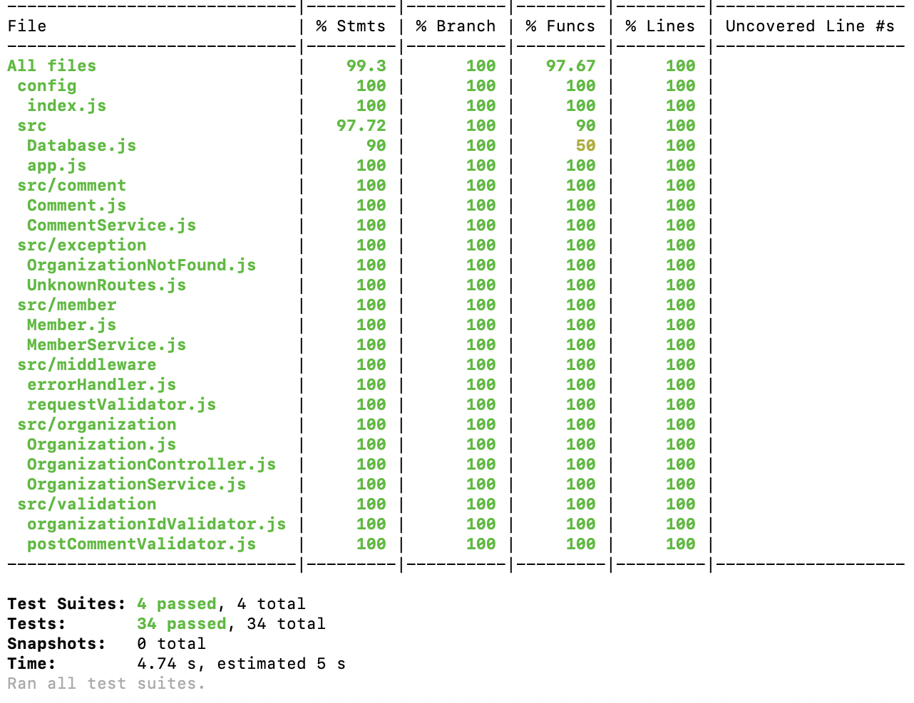

# Organizations-API

## Running Application
To run the application, assuming that you have Docker installed, you can follow these steps:

### Create .env file
We will run the application in development, and it's already sets on `docker-compose.yml` file, so create a new file
name `.env.dev` on the root of this project:

```text
APPLICATION_PORT=8012
POSTGRES_USER=postgres
POSTGRES_PASSWORD=pass
POSTGRES_PORT=5432
SEED_FOLDER=./seeds
```

Or you can rename the provided file `.env.example` to `.env.dev`
and reconfigure it as you like

### Running docker-compose
This application (organizations-api) will be automatically built when running the command below.

```shell
docker-compose --env-file ./.env.dev up --renew-anon-volumes -d postgres organizations-api
```

These are the explanations for those command:

1) Run containers by passing the `.env.dev` file
2) `-d postgres organizations-api` is argument parameter when we needs to run specific containers,
    in these case is `postgres` and `organizations-api`
3) `--renew-anon-volumes` is an options we use when we want to recreate new volumes instead of using the previous volume
   by containers
   
The application will be started, and will be running on `localhost:8123`. We can also access the PostgreSql database on
`localhost:54326`

If you got an error while running the command above, you can try to comment the depends_on from `docker-compose.yml` file,
then run it from the `postgres` first while waiting until `postgres` container is ready to accept the connection,
and then runs the `organizations-api` container.

Here is the sequence:

```shell
docker-compose --env-file ./.env.dev up --renew-anon-volumes -d postgres
```

Then:

```shell
docker-compose --env-file ./.env.dev up --renew-anon-volumes -d organizations-api
```

### Routes
Here are the list of the routes:
```text
GET /orgs/{orgId}/comments => Gets all comments posted on specific organization
POST /orgs/{orgId}/comments => Post / publish comment on specific organization
DELETE /orgs/{orgId}/comments => Delete / Change the status of all comments on specific organization

GET /orgs/{orgId}/members => Get all members on specific organization and sorts it by followers count
```

### Seeds data
Seeds data means that data will be provided whenever the application is starting up.

Here are the list of Organizations registered in database:

| orgId        | Organization |
| ------------- |:----------:|
| xendit      | Xendit       |
| google      | Google       |
| apple       | Apple        |
| microsoft   | Microsoft    |
| lestari     | Lestari      |


## Running Test
To run test, please follow instructions below

### Create .env file
We use the same `.env` file format, the difference is only on the `SEED_FOLDER` key,
which for test will be pointed to directory `/seeds-test`. Here is an example:

```text
APPLICATION_PORT=8013
POSTGRES_USER=postgres
POSTGRES_PASSWORD=pass
POSTGRES_HOSTNAME=localhost
POSTGRES_PORT=5432
SEED_FOLDER=seeds-test
```

Don't forget to save this configuration as `.env.test`

### Running docker-compose
We then run the `postgresql` container. Use these command:

```shell
docker-compose --env-file ./.env.test up --renew-anon-volumes -d postgres
```

### Run the test
Please make sure to check that `postgresql` container is already up and running.
Then, you can use these command

```shell
npm run test
```

It will then generate the report too for this application.

## Coverage Report

